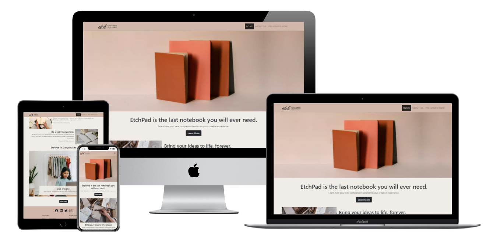

# EtchPad by Etch


## Disclaimer

The stories, people, brands and products in this software development project are fictitious and any resemblance to real life occurrence is by pure coincidence. The developer of this project, as part of an academic portfolio, referred to and used various open source materials available online to create an interactive brochure website, all of which are credited at the end.

## Project Overview

This is a front-end web development project to showcase a premium stationery product called EtchPad by the limited company Etch.

Unlike top competitors which sell generalised stationery products, Etch dedicates effort to serve a market niche that appreciates premium and long-lasting products. Its sole product called EtchPad is an archive-grade / museum-grade notebook for drawing and note-taking.

As an emerging online retailer, Etch wants to establish an online presence before actively trading. Therefore, this project is endeavoured with a mobile-first approach with the aim of building an email list, increasing brand and product awareness and kickstarting web traffic flow.

### Company Goals
* Develop the website as part of a brand awareness campaign in preparation for the product launch.
* Create an email list for newsletter, promotions and notification for product launch.
* Establish an online presence before trading.

### Target Audience
* New or accustomed to using internet websites.
* Demographics of all ages that value high quality stationery for recreational, professional and/or academic purposes.
* Niche target of people that are quality conscious, collectors and gift buyers.
* Minimalist aesthetic.

## The User Experience

### User Stories
As a user of this website, I want to...
* Feel that the website is secure for use without worry of privacy infringement or data loss.
* Easily navigate and interact with features for an enjoyable experience.
* See how the product works, its quality, and when it’s going to be available to help influence reason for purchasing.
* Feel that the business is credible to ensure a positive purchasing experience.
* Be able to contact the business for inquiries and sales support.
* Know the story behind the product to further influence buying decisions.

### Wireframes
[Figma](https://www.figma.com/) was chosen for the wireframing environment as it offers powerful features for free.  
A [Low Fidelity Wireframe Template](https://www.figma.com/community/file/829375674987486138) by Annick Huber was used to create the wireframes within Figma.  
Screenshots for desktop/large tablet wireframes available [here](./assets/testing/wireframes/desktop/).  
Screenshots for mobile/small tablet wireframes available [here](./assets/testing/wireframes/mobile/).

### Design
Device Dimensions

* [The Bootstrap 5 Framework](https://getbootstrap.com/docs/5.0/layout/containers/) uses predetermined device dimensions:
  * Extra small <576px
  * Small ≥576px
  * Medium ≥768px
  * Large ≥992px
  * X-Large ≥1200px
  * XX-Large ≥1400px
* This allows for a responsive and personalised website experience.

Color Pallette
* 54 open source images relevant to the product were sampled through [Palette Generator](https://palettegenerator.com/) to determine the most dominant colours. 
* The following were chosen as the main colors of the website:
  * Primary #24201E
  * Secondary #D0B7AA
  * Tertiary #F0EDE8
* The text color (Primary) against the background (Secondary) and Tertiary colors passed the contrast test for legibility using a calculator by [WebAim](https://webaim.org/resources/contrastchecker/).
* [Paletton](https://paletton.com/) was used to create variations of the primary colors above for stylistic purposes.

Typography
* [The Bootstrap 5 Framework](https://getbootstrap.com/docs/5.0/content/reboot/#native-font-stack) uses a predetermined set of native fonts,
* Allowing for maximum compatibility while maintaining aesthetic coherence:
```
$font-family-sans-serif:
  // Cross-platform generic font family (default user interface font)
  system-ui,
  // Safari for macOS and iOS (San Francisco)
  -apple-system,
  // Windows
  "Segoe UI",
  // Android
  Roboto,
  // Basic web fallback
  "Helvetica Neue", Arial,
  // Linux
  "Noto Sans",
  "Liberation Sans",
  // Sans serif fallback
  sans-serif,
  // Emoji fonts
  "Apple Color Emoji", "Segoe UI Emoji", "Segoe UI Symbol", "Noto Color Emoji" !default;
```

Logo
* [Original logo](https://looka.com/s/79844723) generated by [Looka](https://looka.com).
* Used the generated logo as inspiration to create a custom logo using [Figma](https://www.figma.com/).
* A handwritten font was chosen for the company name to associate it with the stationery niche.
* The slogan "HIGH-GRADE STATIONERY" conveys the durability of the museum-grade product. 
* It is capitalised in thin san-serif font to balance the extravagance of the logo.

Content
* Photos related to writing, notebooks and drawing were derived from [Pexels](https://www.pexels.com/).
* Icons were derived from [Bootstrap V Icons](https://blog.getbootstrap.com/2021/01/07/bootstrap-icons-1-3-0/).
* The first letter of the logo was converted to a favicon using a [Favicon Generator](https://realfavicongenerator.net/).
* Content was curated from open source material to convey minimalism, premium quality especially through lifestyle scenes.
* Privacy policy was created using a [privacy policy generator](https://www.privacypolicygenerator.info/) to further convey legitimacy.

Copywriting and Imagery
* The homepage content is heavily centered on selling the benefits of the product.
* A combination of vivid imagery and active descriptions helps portray a positive experience.
* The about us page shows a personal side of the company to increase customer trust.
* The language used in the pre-order page is straightforward and simple, so that users can promptly complete the form without distraction.
* This approach helps the company achieve its business objectives.

Navigation
* The website design is minimalistic for ease of navigation and satisfactory interaction with website features.
* Navbars switch from standard in larger screens to hamburger menus in smaller screens for ease of access.
* The header and footer are both sticky, meaning they remain in relative position and become fixed in the viewport when a scroll position value is reached.
* For accessibility, links are underlined when hovered, the background color of page buttons lighten when hoverd, and links of the current page are underlined in the footer or highlighted in the header.
* Scroll to top buttons are available to quickly navigate to the top of the page from the footer area.

## Project Development Stages

As a Prince2 Practitioner, the developer applied [Prince2](https://www.axelos.com/certifications/propath/prince2-project-management) project management methodology to complete the endeavour.

Project stages are outlined below to organise the development of features in para-sequential phases. 
This means that each phase produces a working set of deliverables with which the project can prematurely and beneficially conclude. 
However, the project can build upon completed features, and progress to the next stage if time and available budgets allow.

Each stage produces a working deliverable and is necessary for the next stage to begin.
Note that each stage is repeated three times: development for mobile, tablets and desktops. 
Stage X is commenced once all previous stages have been completed or suspended.
Each stage involves testing.

[ PROJECT COMPLETED ]

### Stage 1

Pages
* Home Page
* ~~Product Page~~ [ REMOVED ]
* ~~Meet The Team~~ About Us
* Privacy Policy Page

Components
* Header with Navbar
* Footer - Basic
* Favicon

### Stage 2

Pages
* 404 Page
* ~~Contact Us~~ Pre-Order

Components
* ~~Contact Form~~ Pre-Order Form

### Stage 3

Pages
* ~~Blog~~ [ REMOVED ]
* ~~Product History~~ [ REMOVED ]

Components
* ~~Post List~~ [ REMOVED ]
* ~~Post Page~~ [ REMOVED ]
* ~~Timeline Grid~~ [ REMOVED ]
* ~~Loading Screen~~ [ REMOVED ]

### Stage X

Components
* Sitemap
* Navbar - Content
* Footer - Content
* Accessibility
* Scroll to top
* Optimised Photos

## Features

### Implemented

Pages
* Home
  * Shows product benefits and social proof.
  * [Screenshot](./assets/testing/responsive/home-responsive.png)
* About Us
  * Describes company story and founders.
  * [Screenshot](./assets/testing/responsive/about-responsive.png)
* Pre-order
  * Allows user to submit pre-order details.
  * [Screenshot](./assets/testing/responsive/order-responsive.png)
* Privacy Policy
  * Describes terms of privacy policy.
  * [Screenshot](./assets/testing/responsive/privacy-responsive.png)
* 404
  * Notify user of page navigation error.
  * [Screenshot](./assets/testing/responsive/404-responsive.png)

Components
* Screenshots available [here](./assets/testing/showcase/)
* Header and Navbar
  * Converts to hamburger menu for small devices.
  * Highlights current page and underlines hovered link.
* Footer
  * 3 columns in normal mode and 1 column in mobile mode.
  * Current page and hoverd link are underlined.
  * Social media icons spread evenly in small devices and clustered together in others.
  * Company details are displayed.
* Favicons
  * Adds to the brand awareness.
* Carousel
  * Slideshow of image for social proof.
  * Subject description hidden on mobile and displayed in others.
  * Navigation controls available.
* Image Cards
  * Showcase benefit through images and copy.
  * Arranged in columns on mobile devices.
* Founder Biographies
  * Provide a familiar face to the company.
  * Personal descriptions and profiles helps increase resonance with customers.
* Pre-order Form
  * Primary purpose of website.
  * Allows for collection of emails, product and delivery requirements, and further comments from customers.
* Scroll to top
  * For ease of navigation.
* Optimised photos
  * Improves page responsiveness and load time.
* Accessibility
  * Allows visually-impaired users to benefit from the website.
* Sitemap
  * For search engine optimisation.

### Changes

1. Development of the digital sketcher is beyond the scope of this project and will not be implemented.
2. Original product page will be merged with Home page for ease of product visibility.
3. Meet the team page will now incorporate a biography-style layout to showcase a more personal side of the company story.
4. Contact page will now be called the Pre-Order page to better match the project purpose.
5. Photo optimisation will now be mandatory as it largely affects Google Lighthouse score.
6. Due to project time constraints stage 3 is cancelled to commence stage X.
7. About us biography images are made circular for better aesthetic.

### Current Focus

Pages
* N/A

Components
* N/A

### Testing

Validator Testing
* [W3C Validator](https://validator.w3.org/nu/)
  * No issues according to the HTML Validator.
  * [Home](https://validator.w3.org/nu/?doc=https%3A%2F%2Fandodaryl.github.io%2FEtchPad%2Findex.html)
  * [About Us](https://validator.w3.org/nu/?doc=https%3A%2F%2Fandodaryl.github.io%2FEtchPad%2Fabout.html)
  * [Pre-order](https://validator.w3.org/nu/?doc=https%3A%2F%2Fandodaryl.github.io%2FEtchPad%2Forder.html)
  * [Privacy Policy](https://validator.w3.org/nu/?doc=https%3A%2F%2Fandodaryl.github.io%2FEtchPad%2Fprivacy.html)
  * [404](https://validator.w3.org/nu/?doc=https%3A%2F%2Fandodaryl.github.io%2FEtchPad%2F404.html)
  * [Screenshots](./assets/testing/validation/html)
* [CSS Validator](https://jigsaw.w3.org/css-validator/)
  * No errors according to the CSS Validator.
  * Warnings are related to Bootstrap 5 which uses ["CSS browser hacks"](https://getbootstrap.com/docs/5.0/getting-started/browsers-devices/#validators).
  * [Home](https://jigsaw.w3.org/css-validator/validator?uri=https%3A%2F%2Fandodaryl.github.io%2FEtchPad%2F&profile=css3svg&usermedium=all&warning=1&vextwarning=&lang=en)
  * [About Us](https://jigsaw.w3.org/css-validator/validator?uri=https%3A%2F%2Fandodaryl.github.io%2FEtchPad%2Fabout.html&profile=css3svg&usermedium=all&warning=1&vextwarning=&lang=en)
  * [Pre-order](https://jigsaw.w3.org/css-validator/validator?uri=https%3A%2F%2Fandodaryl.github.io%2FEtchPad%2Forder.html&profile=css3svg&usermedium=all&warning=1&vextwarning=&lang=en)
  * [Privacy Policy](https://jigsaw.w3.org/css-validator/validator?uri=https%3A%2F%2Fandodaryl.github.io%2FEtchPad%2Fprivacy.html&profile=css3svg&usermedium=all&warning=1&vextwarning=&lang=en)
  * [404](https://jigsaw.w3.org/css-validator/validator?uri=https%3A%2F%2Fandodaryl.github.io%2FEtchPad%2F404.html&profile=css3svg&usermedium=all&warning=1&vextwarning=&lang=en)
  * [Screenshots](./assets/testing/validation/css)
* [Form Validator](https://formdump.codeinstitute.net/)
  * Correct data is submitted.
  * [Screenshot](./assets/testing/validation/form/order-form.png)
* [Lighthouse](https://developers.google.com/web/tools/lighthouse)
  * Top scores for both desktop and mobile.
  * [Screenshots](./assets/testing/validation/lighthouse/)
* [Favicon Checker](https://realfavicongenerator.net/favicon_checker)
  * Favicons are working.
  * [Home](https://realfavicongenerator.net/favicon_checker?protocol=https&site=andodaryl.github.io%2FEtchPad%2Findex.html)
  * [About Us](https://realfavicongenerator.net/favicon_checker?protocol=https&site=andodaryl.github.io%2FEtchPad%2Fabout.html)
  * [Pre-order](https://realfavicongenerator.net/favicon_checker?protocol=https&site=andodaryl.github.io%2FEtchPad%2Forder.html)
  * [Privacy Policy](https://realfavicongenerator.net/favicon_checker?protocol=https&site=andodaryl.github.io%2FEtchPad%2Fprivacy.html)
  * [404](https://realfavicongenerator.net/favicon_checker?protocol=https&site=andodaryl.github.io%2FEtchPad%2F404.html)
  * [Screenshots](./assets/testing/validation/favicons/)
* [Accessibility Checker](https://wave.webaim.org/)
  * No errors found.
  * Warnings refer to mandatory features such as noscript and links to home page or placeholder links (e.g. twitter in about us page).
  * [Home](https://wave.webaim.org/report#/https://andodaryl.github.io/EtchPad/index.html)
  * [About Us](https://wave.webaim.org/report#/https://andodaryl.github.io/EtchPad/about.html)
  * [Pre-order](https://wave.webaim.org/report#/https://andodaryl.github.io/EtchPad/order.html)
  * [Privacy Policy](https://wave.webaim.org/report#/https://andodaryl.github.io/EtchPad/privacy.html)
  * [404](https://wave.webaim.org/report#/https://andodaryl.github.io/EtchPad/404.html)
  * [Screenshots](./assets/testing/validation/accessibility)  

Additional Testing
* Device / Screen Size
  * Website is visually responsive on mobile, tablet and desktop according to this [Mock Up Generator](http://techsini.com/multi-mockup/)
  * [Screenshots](./assets/testing/responsive/)
* User Stories: As a user of this website, I want to...  
  1. Feel that the website is secure for use without worry of privacy infringement or data loss:  
     The website is served via https meaning it is secure.  
     The privacy policy page tells me that the website respects my privacy rights.  
  2. Easily navigate and interact with features for an enjoyable experience:  
     The navigation is easily accessible at the top of the screen as I scroll.  
     It is clear to see what buttons are clickable  and if I have clicked links thanks to appropriate color schemes and text underlining.  
  3. See how the product works, its quality, and when it’s going to be available to help influence reason for purchasing:  
     The home page clearly described the benefits of the product.  
     There is a pre-order page to help inform me when the product is available.  
  4. Feel that the business is credible to ensure a positive purchasing experience:  
     The about us page shows me who is behind this website.  
     At the footer is the company address and registration number which adds to the legitimacy of the business.  
     Be able to contact the business for inquiries and sales support.  
  5. The company address available allows me to write the company directly:  
     There is also an email shown in the footer section.  
     Additionally, in the pre-order page is a section through which I am invited to provide additional comments for the team to consider.  
  6. Know the story behind the product to further influence buying decisions.  
     The about us page describes the story behind the product.  
     The homepage shows real people using the product.  
* Process
  * Navigation
    * The logo is a link which leads to the homepage.
    * The navbar displays a hamburger menu in mobile mode.
    * The header navlink which leads to the current loaded page is highlighted.
    * The footer navlink which leads to the current loaded page is underlined.
    * Hovering over a navlink underlines it.
    * Social media icons in the footer are
      * situated close together in desktop/tablet mode.
      * spread evenly in mobile mode.
      * opens in a new tab to the relevant social media platform.
  * Home
    * Shows product features and social proof.
    * Clicking the logo and the home nav link leads to the home page.
    * The hero page changes its aspect ratio in mobile mode.
    * The learn more button
      * leads to the first benefits-section.
      * lightens its background color when hovered.
    * The benefits-section image and text arranges into columns in mobile/tablet mode.
    * The text is centered in mobile mode.
    * The carousel displays notes from users which disappears in mobile mode.
    * Carousel images automatically change or manually changed using buttons in the component.
    * Scroll to top button
      * leads to the top of the screen.
      * lightens its background color when hovered.
  * About
    * Shows co-founder biographies and a brief company story.
    * Images are displayed in a circle.
    * Social media buttons open a new tab to Twitter.
    * Scroll to top button lead to the top of the screen.
    * Scroll to top button
      * leads to the top of the screen.
      * lightens its background color when hovered.
  * Pre-order
    * Shows a form for pre-ordering and optional commentary.
    * Labels look like placeholders and automatically move away while entering values.
    * Identity, contact, delivery and product info are mandatory.
    * An extendible text section is available for further comments.
    * A privacy agreement checkbox is mandatory.
    * The privacy policy link opens in the current tab.
    * Values entered are saved despite moving away from the page.
    * Submitting with empty mandatory values displays a warning.
    * Submit button
      * lightens its background color when hovered.
      * submits values to a form validator.
  * Privacy-policy
    * Shows privacy policy terms.
    * Website link opens to home page in a new tab.
    * Scroll to top button
      * leads to the top of the screen.
      * lightens its background color when hovered.
  * Sitemap
    * Displays sitemap details without styling as intented.
  * 404
    * Shows page not found notice and further details.
    * Entering 404.html or a non-existent sub-directory leads to this page.
    * Despite minimal content, the footer remains at the bottom of the page.

Bugs
* Fixed
  * Missing favicons according to Favicon Checker
    * [Error Screenshot](./assets/testing/bugs/favicons/favicon-error.png)
    * [Fixed Screenshot](./assets/testing/bugs/favicons/favicon-error-fixed.png)
    * Recreated favicons from Favicon Generator with appropriate links.
  * Scroll-to-target visual misalignment
    * [Error Screenshot](./assets/testing/bugs/scroll-to-target/scroll-to-target-error.png)
    * [Fixed Screenshot](./assets/testing/bugs/scroll-to-target/scroll-to-target-fixed.png)
    * This is due to the sticky header feature.
    * Fixed using `scroll-margin-top` and `scroll-padding-top` as outlined in [this article](https://getpublii.com/blog/one-line-css-solution-to-prevent-anchor-links-from-scrolling-behind-a-sticky-header.html).
  * Hero page carousel displaced by a few pixels when traversing image gallery
    * [Normal Screenshot](./assets/testing/bugs/carousel/carousel-normal.png)
    * [Error Screenshot](./assets/testing/bugs/carousel/carousel-error.png)
    * Problem is because of inconsistent image aspect ratios.
    * Fixed through image optimisation.
* Backlog
  * N/A

## Deployment

With the help of this [tutorial](https://dev.to/yuribenjamin/how-to-deploy-react-app-in-github-pages-2a1f), the website was deployed to GitHub pages using the following steps:
1. After logging in, navigate to the target Github repo.
2. Select the “Settings” tab.
3. Select the “Pages” button on the menu to the left.
4. Select the "Main" branch as the source.
5. Select the "Save" button.
6. The website will be deployed automatically and a link to the live website will be displayed.

The live page is available [here](https://andodaryl.github.io/EtchPad/).

## Forking Github Repos

According to [official Github documentation](https://docs.github.com/en/get-started/quickstart/fork-a-repo), this repo can be forked using the following steps:
1. After logging in, navigate to the target Github repo.
2. Select the "Fork" button located in top-right area of the page.
3. Select target location for the forked repo.

## Cloning Forked Repo via HTTPS

Additionally, you can download a local copy of the forked repo using the following steps:
1. After logging in to Github, navigate to the desired forked repo.
2. Select the "Code" button.
3. Copy the URL link below "Clone with HTTPS".
4. In a terminal with "GIT" installed, navigate to your target directory.
5. Using the `git clone` command, paste in the URL and press enter:
```
$ git clone https://github.com/YOUR-USERNAME/YOUR-REPO 
\> Cloning into `YOUR-REPO`...
\> remote: Counting objects: 10, done.
\> remote: Compressing objects: 100% (8/8), done.
\> remove: Total 10 (delta 1), reused 10 (delta 1)
\> Unpacking objects: 100% (10/10), done.
```

## Credits

Maintaining competence requires continuous learning from and reflection upon the work of others. It is important to give credit and acknowledgement not only to recognise time and effort expended but also to illustrate the rationale behind the methods applied and direct observers to the origins thereof.

Tutorials, resources used are as follows:

### Media

Images
* All images used were edited with [Adobe Photoshop](https://www.adobe.com/ie/products/photoshop.html).
* Original sources are as follows:
  * Home
    * Hero by [Arina K.](https://www.pexels.com/@arina-krasnikova)
    * Benefits A by [Cottonbro](https://www.pexels.com/@cottonbro)
    * Benefits B by [Bich T.](https://www.pexels.com/@thngocbich)
    * Benefits C is a combination of images by [Cottonbro](https://www.pexels.com/@cottonbro), [Porapak A.](https://www.pexels.com/@nurseryart), [Monstera](https://www.pexels.com/@gabby-k), [Miguel P.](https://www.pexels.com/@padrinan), and [Madison I.](https://www.pexels.com/@mdsnmdsnmdsn).
    * Benefits D by [Polina K.](https://www.pexels.com/@polina-kovaleva).
    * Carousel 1 by [Pavel D.](https://www.pexels.com/@pavel-danilyuk).
    * Carousel 2 by [Mikhail N.](https://www.pexels.com/@mikhail-nilov).
    * Carousel 3 by [Katerina H.](https://www.pexels.com/@katerina-holmes).
    * Carousel 4 by [Liza S.](https://www.pexels.com/@liza-summer).
    * Carousel 5 by [Vlada K.](https://www.pexels.com/@vlada-karpovich).
    * Carousel 6 by [Pavel D.](https://www.pexels.com/@pavel-danilyuk).
  * About
    * Executive 1 by [Sora S.](https://www.pexels.com/@sora-shimazaki).
    * Executive 2 is a combination of images by [Sora S.](https://www.pexels.com/@sora-shimazaki) and [Laura T.](https://www.pexels.com/@laura-tancredi).

### Content

Copy
* Product copy was inspired by the folowing resources:
  * [What to Look for in a Notebook](https://www.jennibick.com/blogs/news/123062723-what-to-consider-when-choosing-a-paper-notebook)
  * [Competitor's Blog](https://www.thejournalshop.com/thejournal/how-to-choose-the-perfect-notebook/)
  * [Acid Free vs Archival Paper](https://www.strathmoreartist.com/faq-full/what-is-the-difference-between-acid-free-archival.html)
  * [Types of Drawing Paper](https://verbnow.com/types-of-drawing-paper/)
  * [Types of Drawing Paper - Youtube](https://www.youtube.com/watch?v=uHPIYMhbmGc)
  * [Paper for Drawing 1](https://www.artistsnetwork.com/art-mediums/drawing-what-kind-of-paper-should-you-use/)
  * [Paper for Drawing 2](https://www.strathmoreartist.com/blog-reader/what-paper-should-i-use-for-my-art.html)
  * [Paper for Art](https://www.strathmoreartist.com/blog-reader/what-paper-should-i-use-for-my-art.html)

* The about us page was inspired by this article:
  * [Meet The Team Examples](https://amasty.com/blog/30-best-meet-the-team-pages-examples-and-trends/)

Competitor Research
* Observing competitors helped determine the market positioning of this retail website.
* [Notebook Therapy](https://notebooktherapy.com/)
* [The Journal Shop](https://www.thejournalshop.com/)

Content Tools / Sources

_See technologies section for development environment and content generators / sources._

### Tutorials
Various online tutorial resources were implemented in the creation of this site:  

Youtube
* [Figma Tutorial](https://www.youtube.com/watch?v=RYDiDpW2VkM&t=7s)
* The header was inspired from this [Bootstrap V Navbar Tutorial](https://www.youtube.com/watch?v=akXfF066MY0)  

Articles
* [HTML CSS Best Practice](https://learn.shayhowe.com/html-css/writing-your-best-code/)
* [HTML CSS Best Practice 2](https://medium.com/@inceptiondj.info/html-css-coding-best-practice-fadb9870a00f)
* [Git and Github Basics](https://blog.red-badger.com/2016/11/29/gitgithub-in-plain-english)
* [Writing Git Commits](https://cbea.ms/git-commit/)
* [Deploy to Github Pages](https://dev.to/yuribenjamin/how-to-deploy-react-app-in-github-pages-2a1f)
* [CLI Basics](https://github.com/jlevy/the-art-of-command-line#readme)
* [Markdown Basics](https://github.com/adam-p/markdown-here/wiki/Markdown-Cheatsheet)
* [How to Write a README](https://www.freecodecamp.org/news/how-to-write-a-good-readme-file/)
* [Writing User Stories](https://www.mountaingoatsoftware.com/agile/user-stories)
* [Bootrap V Basics](https://www.w3schools.com/bootstrap5/)
* [CSS Grid](https://www.w3schools.com/css/css_grid.asp)
* [CSS Grid 2](https://css-tricks.com/snippets/css/complete-guide-grid/)

### Technologies

Tools used in development:

Development Environment
* [GitPod](https://www.gitpod.io/)
* [Figma](https://www.figma.com/)
* [Adobe Photoshop](https://www.adobe.com/ie/products/photoshop.html)

Testing
* [Lighthouse](https://developers.google.com/web/tools/lighthouse)
* [Chrome Devtools](https://developer.chrome.com/docs/devtools/)
* [W3C Validator](https://validator.w3.org/nu/)
* [CSS Validator](https://jigsaw.w3.org/css-validator/)
* [Code Institute - Form Dump](https://formdump.codeinstitute.net/)
* [Favicon Checker](https://realfavicongenerator.net/favicon_checker)
* [Accessibility Checker](https://wave.webaim.org/)

Content Generators / Sources
* [Sitemap Generator](https://www.xml-sitemaps.com/)
* [Privacy Policy Generator](https://www.privacypolicygenerator.info/)
* [Image Palette Generator](https://palettegenerator.com/)
* [Palette Generator](https://paletton.com/)
* [Logo Maker](https://looka.com/logo-maker/)
* [Real Favicon Generator](https://realfavicongenerator.net/)
* [Code Institute Gitpod Template](https://github.com/Code-Institute-Org/gitpod-full-template)
* [Code Formatter](https://webformatter.com/)

Frameworks / Libraries
* [Boostrap V](https://getbootstrap.com/)
* [Boostrap V Icons](https://blog.getbootstrap.com/2021/01/07/bootstrap-icons-1-3-0/)
* [Figma Low Fidelity Wireframe Template](https://www.figma.com/community/file/829375674987486138)

Languages
* [HTML5](https://www.w3schools.com/html/default.asp)
* [CSS](https://www.w3schools.com/css/default.asp)
* [Javascript](https://www.w3schools.com/js/default.asp)

### Further Acknowledgements
The vibrant [Slack](https://slack.com/) community, cohort, tutors and my mentor Akshat Garg at [Code Institute](https://codeinstitute.net/).

[Code Institute](https://codeinstitute.net/), [FreeCodeCamp](https://www.freecodecamp.org/), [TheOdinProject](https://www.theodinproject.com/), and [W3Schools](https://www.w3schools.com/) for providing me with fundamental skills for software development.

[Prince2](https://www.axelos.com/certifications/propath/prince2-project-management) for the project management methodology.